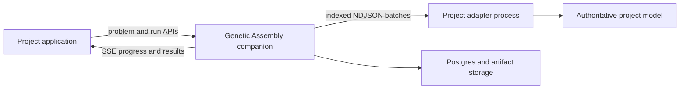

# Integrating Genetic Assembly into another repository

Genetic Assembly is designed to run beside a project rather than become part of its domain model. Rust owns NSGA-II population mechanics, deterministic seeds, durable execution, checkpoints, constraints, and analytics. Your project keeps ownership of candidate meaning, simulation, domain repair, and final result materialization.



WASM is not required. The normal integration uses a native Rust companion container and a trusted project-authored adapter executable.

## Choose an integration path

Use the smallest boundary that matches the project:

| Project | Recommended path |
| --- | --- |
| Static Three.js scene with transform, visibility, material, or metadata levers | Use `@genetic-assembly/three` and the built-in GLB/QuickJS facade. |
| TypeScript simulation, ABM, scheduling model, or domain engine | Implement `@genetic-assembly/adapter-sdk`. |
| Python, native Rust, or another language | Implement the same versioned NDJSON protocol directly. |
| Native Rust evaluator that needs shared immutable memory | Integrate the core crate and use `Arc`/Rayon, or add a native built-in backend. |

The rest of this guide focuses on the generic adapter path.

## 1. Install and scaffold

Once the packages and companion image have been published:

```bash
npm install @genetic-assembly/client
npm install --save-dev @genetic-assembly/adapter-sdk @genetic-assembly/cli typescript
npx ga init
```

`ga init` creates these non-overwriting starter files:

```text
.genetic-assembly/
├── .env
├── adapter.json
├── adapter.mjs
├── compose.yml
└── problem.json
```

Validate and start the scaffold with:

```bash
npx ga test-adapter
npx ga doctor
npx ga up
```

The generated Compose file mounts the project root read-only at `/workspace` inside the companion container. Adapter launch paths therefore use `/workspace/...`, not macOS or Windows host paths.

Before the first registry release, use a local Genetic Assembly checkout:

```bash
# Run in the Genetic Assembly checkout.
npm run headless:build
npm run adapter-sdk:build
npm run cli:build
docker build -t genetic-assembly-server:0.2.0 .

# Run in the consuming repository, replacing the path.
npm install /absolute/path/to/genetic-assembly/headless-client
npm install --save-dev \
  /absolute/path/to/genetic-assembly/adapter-sdk \
  /absolute/path/to/genetic-assembly/cli
npx ga init
```

Set this value in the generated `.genetic-assembly/.env` while using the locally built image:

```dotenv
GA_IMAGE=genetic-assembly-server:0.2.0
```

The package release workflow publishes the same interfaces without requiring consumers to copy Rust source.

## 2. Define the mathematical problem

A problem bundle declares stable variable IDs, mathematical bounds, objective directions, constraints, and immutable input references. It does not contain mutable model state.

```ts
import type { ProblemBundle } from "@genetic-assembly/client";

export const problem: ProblemBundle = {
  schema_version: 1,
  name: "Service layout",
  variable_ids: ["x", "y", "staff", "automated"],
  problem: {
    variables: [
      { kind: "real", lower: 0, upper: 100 },
      { kind: "real", lower: 0, upper: 100 },
      { kind: "integer", lower: 1, upper: 20, step: 1 },
      { kind: "binary" },
    ],
    objectives: [
      { name: "Operating cost", direction: "minimize" },
      { name: "Travel time", direction: "minimize" },
      { name: "Coverage", direction: "maximize" },
    ],
  },
  constraints: [
    { name: "Required capacity", feasible_when: "lte_zero" },
  ],
  metadata: { model: "service-layout-v1" },
};
```

Rules:

- `variable_ids`, when supplied, must match variable order and length.
- Real and integer bounds are inclusive.
- Integer steps must be positive and fit the declared range.
- Every returned objective and constraint must be finite.
- A constraint is feasible when its value is `<= 0`.
- Objective order and constraint order are contractual.
- Maximization is declared in the bundle; do not negate it in the adapter.

Problem registration is content-addressed. Registering identical JSON returns the existing immutable revision.

## 3. Select an operator mode

### Built-in operators

Use `operator_mode: "builtin"` when candidates are ordinary real, integer, and binary vectors. Rust supplies bounded sampling, SBX crossover, polynomial mutation, integer variation, and bit mutation. The adapter only evaluates and optionally validates or materializes candidates.

This is the best first integration because it minimizes adapter code.

### Adapter-owned operators

Use `operator_mode: "adapter"` when raw genetic operations can create invalid domain states or when the genome is best constructed in meaningful blocks. The adapter must implement:

- `seedPopulation` for domain-aware initial candidates.
- `makeOffspring` for crossover, mutation, repair, and canonicalization.

Rust still performs tournament selection, constraint domination, non-dominated sorting, crowding, and parent-plus-offspring environmental selection.

Operation seeds arrive as decimal strings so JavaScript retains all 64 bits. The same request and seed must produce the same canonical genes.

## 4. Implement a TypeScript adapter

The following built-in-operator adapter evaluates two competing distance objectives and one capacity constraint:

```ts
// src/optimization/model.ts
import {
  defineAdapter,
  type GeneticAssemblyAdapter,
} from "@genetic-assembly/adapter-sdk";

export const adapter: GeneticAssemblyAdapter = defineAdapter({
  version: "service-layout-v1",

  initialize: () => ({
    operator_mode: "builtin",
    max_concurrency: 1,
    validate_front: true,
    materialize: true,
  }),

  evaluateBatch: (candidates) => candidates.map((candidate) => {
    const [x, y, staff, automated] = candidate.genes;
    const capacity = staff * 8 + automated * 25;

    return {
      id: candidate.id,
      genes: candidate.genes,
      evaluation: {
        objectives: [
          staff * 10 + automated * 60,
          Math.hypot(x - 20, y - 25),
          capacity,
        ],
        constraints: [80 - capacity],
        evidence: {
          metadata: { capacity: String(capacity) },
        },
      },
    };
  }),

  validateFront: (candidates) => candidates.map((candidate) => {
    // Replace this with a higher-fidelity or larger-seed evaluation.
    const [x, y, staff, automated] = candidate.genes;
    const capacity = staff * 8 + automated * 25;
    return {
      id: candidate.id,
      genes: candidate.genes,
      evaluation: {
        objectives: [staff * 10 + automated * 60, Math.hypot(x - 20, y - 25), capacity],
        constraints: [80 - capacity],
      },
    };
  }),

  materialize: (candidates) => candidates.map((candidate) => ({
    id: candidate.id,
    media_type: "application/json",
    data: {
      x: candidate.genes[0],
      y: candidate.genes[1],
      staff: candidate.genes[2],
      automated: candidate.genes[3] === 1,
    },
  })),
});
```

Create the executable entrypoint:

```ts
// src/optimization/adapter.ts
import { serveAdapter } from "@genetic-assembly/adapter-sdk";
import { adapter } from "./model.js";

await serveAdapter(adapter);
```

Stdout is reserved for NDJSON protocol responses. Write logs and diagnostics to stderr with `console.error` or `process.stderr.write`.

Compile or bundle the executable to a path visible inside the companion container, for example:

```text
/workspace/dist/optimization/adapter.js
```

A single-file bundle is recommended when the model has dependencies. The companion image contains Node, but it does not install the consuming project's package graph. A read-only host `node_modules` mount can also be used for pure JavaScript dependencies, but native Node modules must match the container platform.

## 5. Add conformance testing

```ts
// src/optimization/conformance.ts
import { runConformanceSuite } from "@genetic-assembly/adapter-sdk";
import { adapter } from "./model.js";
import { problem } from "./problem.js";

await runConformanceSuite(adapter, problem);
console.log("Adapter conforms.");
```

The suite verifies initialization, capability consistency, ordered IDs, finite dimensions, repeatability, and optional materialization. Add project tests for repair invariants, cancellation, model failures, and known benchmark candidates.

The complete domain-operator example is in [`examples/reference-adapter`](../examples/reference-adapter).

## 6. Register the adapter launch

The launch record is immutable and content-addressed:

```ts
import type { AdapterLaunch } from "@genetic-assembly/client";

export const launch: AdapterLaunch = {
  name: "service-layout",
  adapter_version: "service-layout-v1",
  protocol_version: "genetic-assembly-adapter-v1",
  command: "node",
  args: ["/workspace/dist/optimization/adapter.js"],
  working_directory: "/workspace",
  environment: {},
  timeout_ms: 300_000,
  retry_limit: 1,
};
```

`adapter_version` must exactly match the adapter's `version`. Change it whenever evaluation, repair, variation, model code, or materialization semantics change. Registering the changed launch produces a new revision and prevents old checkpoints from silently resuming with different code.

The adapter process runs inside the companion container in the generated Compose setup. If the Rust server is run natively instead, `command`, `args`, and `working_directory` are native host paths.

Environment values are stored as part of the adapter revision. Do not place long-lived secrets there unless storing them in Postgres is acceptable for the deployment.

## 7. Upload immutable inputs

Upload large inputs before constructing the problem bundle:

```ts
const inputBytes = await fetch("/fixtures/network.bin").then((response) => response.arrayBuffer());
const artifact = await client.uploadArtifact(inputBytes, "application/octet-stream");

problem.artifacts = [{
  name: "network",
  content_hash: artifact.content_hash,
  artifact_key: artifact.artifact_key,
  media_type: artifact.media_type,
}];
problem.metadata = { input_artifact_id: artifact.id };
```

The companion validates artifact hashes when registering the problem and includes them in checkpoint compatibility. In the current local protocol, an adapter that needs the bytes should either:

- Read a project-owned immutable file from the `/workspace` mount, while retaining the registered hash in the problem bundle; or
- Store the returned artifact ID in problem metadata and fetch `/v1/artifacts/{id}` from the local companion during `initialize`.

Do not include full meshes, traces, or simulation states inline in evaluation responses.

## 8. Register revisions and start a run

```ts
import { CompanionClient } from "@genetic-assembly/client";
import { problem } from "./problem.js";
import { launch } from "./launch.js";

const client = new CompanionClient("http://127.0.0.1:3001");

const problemRevision = await client.createProblem(problem);
const adapterRevision = await client.createAdapter(launch);
const run = await client.startRun(problemRevision.id, adapterRevision.id, {
  population_size: 100,
  generations: 200,
  seed: 42,
});

console.log(`Queued run ${run.id}`);
```

Creating the same problem or adapter revision repeatedly is safe. The returned revision IDs can also be cached in project configuration.

## 9. Stream progress and retrieve results

```ts
await client.subscribe(run.id, (event) => {
  switch (event.type) {
    case "generation":
      console.log(
        `generation ${event.summary.generation}: ` +
        `${event.summary.pareto_size} Pareto, ` +
        `${event.summary.feasible_count} feasible`,
      );
      break;
    case "failed":
      console.error(event.error);
      break;
    default:
      console.log(event.type);
  }
});

const status = await client.getRun(run.id);
if (status.status !== "completed") {
  throw new Error(status.error ?? `Run ended as ${status.status}`);
}

const results = await client.getResults(run.id);
const analytics = await client.getAnalytics(run.id);

for (const member of results.members) {
  console.log({
    genes: member.individual.genes,
    objectives: member.individual.objectives,
    constraints: member.individual.constraints,
    materialization: member.materialization,
  });
}
```

The SSE client reconnects with the last event ID. Events are persisted, so a refreshed application can reconstruct progress rather than relying only on events observed while the page was open.

Use `client.cancel(run.id)` for cooperative cancellation.

## 10. Materialize only retained candidates

Ordinary evaluations should return compact values and evidence:

- Canonical genes.
- Objectives and constraints.
- Runtime.
- Warnings.
- Small string metadata.
- Opaque artifact references.

`materialize` runs only for the retained final front. It should produce the project object needed to preview, download, or apply a candidate. Inline JSON larger than 64 KiB is moved into companion artifact storage automatically.

For an ABM, materialization might contain scenario parameters and a reproducibility seed. For a geometry system, it might contain object patches. For a scheduler, it might contain a downloadable assignment table.

## 11. Add adapter concurrency carefully

The companion sends deterministic indexed batches and does not add a Rayon layer around an external adapter. `max_concurrency` declares the adapter's supported internal capacity; protocol requests remain ordered.

A TypeScript adapter may distribute candidates across worker threads or subprocesses and return them in the original request order. Heavy shared state can use `SharedArrayBuffer` only after conversion to appropriate immutable binary structures. Measure memory and startup cost before adding workers.

For stochastic models, use deterministic common random numbers or seeds derived solely from stable request inputs. Candidate ID, arrival order, wall-clock time, and ambient randomness must not change mathematical results.

### Recommended simulation and ABM pattern

For an agent-based or other stateful simulation, keep the genome compact and reconstruct model state inside the adapter:

1. Decode genes into domain parameters.
2. Repair or reject combinations that violate structural rules.
3. Run the authoritative model over a fixed set of search seeds.
4. Aggregate the samples into finite objectives and constraints.
5. Return only compact evidence during population evaluation.
6. Re-run final candidates with more seeds in `validateFront`.
7. Create the project-facing scenario or snapshot in `materialize`.

Do not place a mutable live simulation object in the genome or attempt to checkpoint adapter process memory. Adapter processes are reconstructed from the immutable problem, artifacts, launch revision, and deterministic seeds after a restart.

## 12. Three.js projects

If the project is a static Three.js scene, install `@genetic-assembly/three` instead of writing a generic adapter. Assign stable IDs, export a GLB, register the evaluator, and apply returned patches:

```ts
import {
  CandidatePreview,
  GeneticAssemblyClient,
  exportScene,
} from "@genetic-assembly/three";

mesh.userData.gaId = "movable-box";

const manifest = {
  objects: [{ id: "movable-box", visible: true }],
  levers: [{
    id: "box-x",
    kind: "real" as const,
    lower: -5,
    upper: 5,
    target: { type: "position" as const, object_id: "movable-box", axis: "x" as const },
  }],
};

const api = new GeneticAssemblyClient("http://127.0.0.1:3001");
const exported = await exportScene(scene, manifest);
const sceneRevision = await api.uploadScene(exported.glb, exported.manifest);
const evaluatorRevision = await api.createEvaluator(
  `export function evaluate(ctx) {
    return { objectives: [ctx.targetDistance("movable-box", [4, 0, 0])], constraints: [] };
  }`,
  { objectives: [{ name: "Target distance", direction: "minimize" }] },
);
const run = await api.startRun(sceneRevision.id, evaluatorRevision.id, {
  population_size: 64,
  generations: 50,
  seed: 42,
});
await api.subscribe(run.id, console.log);
const results = await api.getResults(run.id);

const preview = new CandidatePreview(scene);
preview.apply(results.members[0]);
preview.revert();
```

The v1 Three.js facade supports static scenes, groups, meshes, triangle buffer geometry, transforms, visibility, numeric material properties, and numeric `userData` paths. Skinned meshes, morph targets, topology changes, vertex deformation, dynamic physics, and executable scene objects remain outside the contract.

## Integration checklist

- [ ] Variable, objective, and constraint order is stable and documented.
- [ ] All evaluation values are finite.
- [ ] Constraint signs follow `<= 0` feasibility.
- [ ] The adapter returns one result per request in request order.
- [ ] Canonical genes remain typed and bounded.
- [ ] Repeated indexed evaluations are deterministic.
- [ ] `adapter_version` changes with model semantics and matches initialization.
- [ ] Adapter paths are valid inside `/workspace` in Docker mode.
- [ ] Large evidence is stored as artifacts rather than returned inline.
- [ ] Materialization is limited to retained candidates.
- [ ] Cancellation and model failures have tests.
- [ ] The conformance suite passes before starting long runs.
- [ ] The project records the problem revision, adapter revision, run ID, and solver seed needed for reproducibility.
